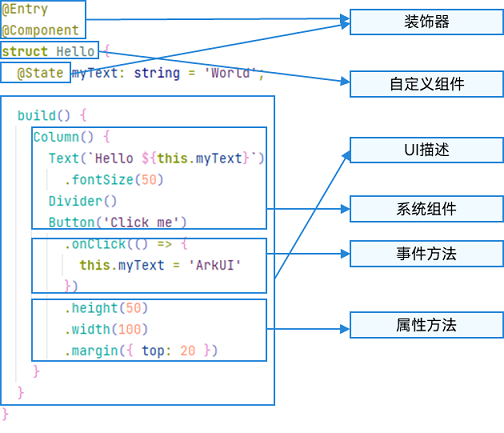
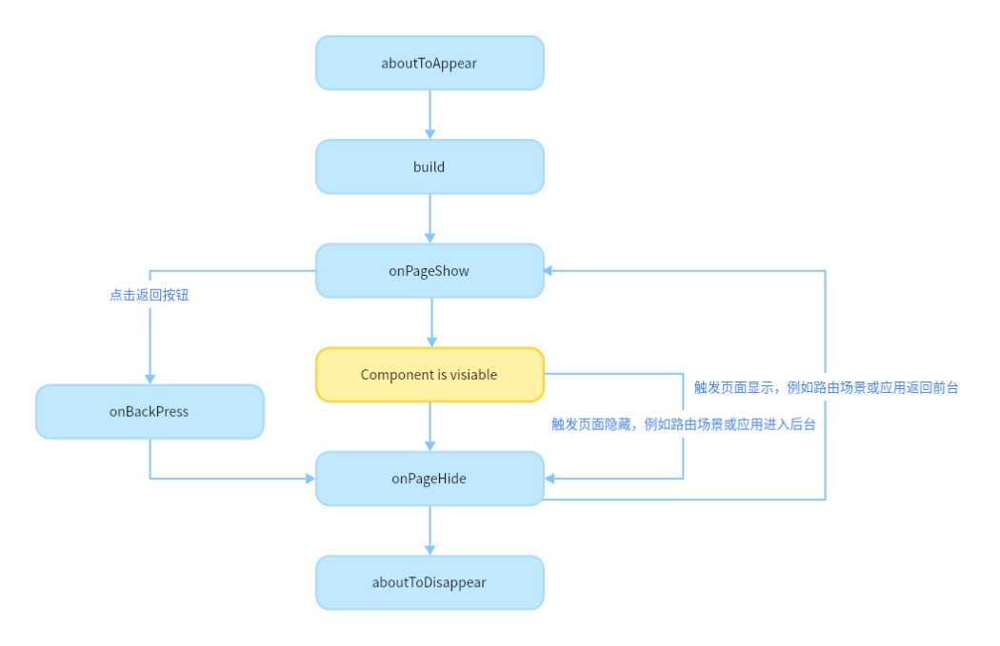

# 简介
ArkTS是基于TS语言，但是做了如下的扩展：
1.基本语法
2.状态管理
3.渲染控制

## 基本语法

### ArkTS的基本组成：

装饰器：
---
* @Component表示自定义组件，
* @Entry表示该自定义组件为入口组件，
* @State表示组件中的状态变量，状态变量变化会触发UI刷新

UI描述
---
以声明式的方式来描述UI的结构，例如build()方法中的代码块

自定义组件
---
可复用的UI单元，可组合其他组件，如上述被@Component装饰的struct Hello

系统组件
---
ArkUI框架中默认内置的基础和容器组件，可直接被开发者调用

属性方法
---
width，height

事件方法
---
onClick


### 声明式UI描述
创建组件
----
1.不用new关键字，直接向kotlin实例化对象即可   
2.参考api进行构造参数的设置  
3.属性配置，类似构建者模式通过.的方式扩展属性配置  
4.以“.”链式调用的方式配置系统组件支持的事件  
```
myClickHandler(): void {
  this.counter += 2;
}
fn = () => {
  console.info(`counter: ${this.counter}`)
  this.counter++
}

Column() {
  Text('item 1')
  .fontSize(this.size)
  .onClick(() => {//1、箭头函数配置
    this.myText = 'ArkUI';
  })
  .onClick(function(){//2、匿名函数表达式配置组
    this.counter += 2;
  }.bind(this))
  .onClick(this.myClickHandler.bind(this))//3、组件的成员函数配置组
  .onClick(this.fn)//4、声明的箭头函数，可以直接调用，不需要bind this
  Divider()
  Image('test.jpg')
  .width(this.count % 2 === 0 ? 100 : 200)    
  .height(this.offset + 100)
}
```
容器组件：Column、Row、Stack、Grid、List 支持子组件配置
---
如果组件支持子组件配置，则需在尾随闭包"{...}"中为组件添加子组件的UI描述

### 自定义组件
系统提供的组件成为系统组件；根据自身业务逻辑封装成自定义组件
自定义组件特点：
可组合、可重用、数据驱动UI更新

自定义组件的基本结构
---
```
@Component
struct MyComponent {
  build() {
  }
}
```
struct：自定义组件基于struct实现，struct + 自定义组件名 + {...}的组合构成自定义组件，不能有继承关系。对于struct的实例化，可以省略new     
@Component：@Component装饰器仅能装饰struct关键字声明的数据结构   
build()函数：build()函数用于定义自定义组件的声明式UI描述，自定义组件必须定义build()函数      
@Entry：@Entry装饰的自定义组件将作为UI页面的入口，单UI最多只能有一个Entry。@Entry可以接受一个可选的LocalStorage的参数   
0、自定义组件可以在build(){}之外定义局部变量和函数，   
1、其build()函数下的根节点唯一且必要，且必须为容器组件，其中ForEach禁止作为根节点    

页面和自定义组件生命周期
---

aboutToAppear -> build -> onPageShow -> onPageHide -> aboutToDisappear


- 自定义组件的创建和渲染流程  
1.自定义组件的创建：自定义组件的实例由ArkUI框架创建。   
2.初始化自定义组件的成员变量：通过本地默认值或者构造方法传递参数来初始化自定义组件的成员变量，初始化顺序为成员变量的定义顺序。   
3.如果开发者定义了aboutToAppear，则执行aboutToAppear方法。   
4.在首次渲染的时候，执行build方法渲染系统组件，如果子组件为自定义组件，则创建自定义组件的实例。在首次渲染的过程中，框架会记录状态变量和组件的映射关系，当状态变量改变时，驱动其相关的组件刷新。   


- 自定义组件重新渲染
  框架观察到了变化，将启动重新渲染。  
  根据框架持有的两个map（自定义组件的创建和渲染流程中第4步），框架可以知道该状态变量管理了哪些UI组件，以及这些UI组件对应的更新函数。执行这些UI组件的更新函数，实现最小化更新  

- 自定义组件的删除
  在删除组件之前，将调用其aboutToDisappear生命周期函数，标记着该节点将要被销毁。ArkUI的节点删除机制是：后端节点直接从组件树上摘下，后端节点被销毁，对前端节点解引用，前端节点已经没有引用时，将被JS虚拟机垃圾回收。
  自定义组件和它的变量将被删除，如果其有同步的变量，比如@Link、@Prop、@StorageLink，将从同步源上取消注册

router.pushUrl 页面1不会销毁，只是不可见了，多次这个操作是否会有问题？
router.replaceUrl 页面1会走销毁
router.back / onBackPress 页面2走销毁

组件创建的时候变量如何传递过来？

- @Builder装饰器：自定义构建函数
可以给组件容器添加组件
```
//定义函数：参数是引用方式
@Builder function generateText($$: { paramA1: string }){
  Row() {
    Text(`generateText: ${$$.paramA1} `)
  }
}
//调用函数，定义的时候参数名:参数类型，调用的时候将参数名:具体引用
generateText({ paramA1: this.label })

//按值传递
@Builder function overBuilder(paramA1: string) {
  Row() {
    Text(`UseStateVarByValue: ${paramA1} `)
  }
}
@Entry
@Component
struct Parent {
  @State label: string = 'Hello';
  build() {
    Column() {
      overBuilder(this.label)
    }
  }
}
```


## 状态管理


## 渲染控制