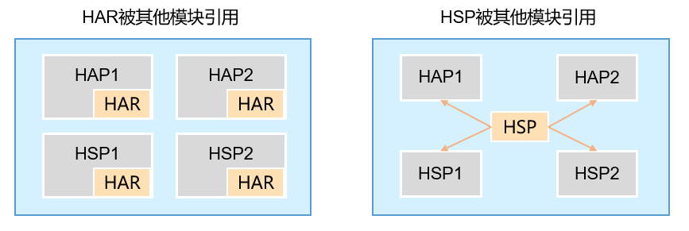

# 应用程序包基础知识

应用泛指运行在操作系统上，为用户提供特定服务的程序
一个应用所对应的软件包文件，称为“应用程序包”
系统还屏蔽了不同的芯片平台的差异

应用支持多module设计：模块化设计

- Module类型
1.Ability类型的Module
  用于实现应用的功能和特性，编译后对应的是HAP（Harmony Ability Package）包
  HAP包可以独立安装和运行，是应用安装的基本单位，一个应用中可以包含一个或多个HAP包
  entry类型的Module：应用的主模块，包含应用的入口界面、入口图标和主功能特性，编译后生成entry类型的HAP，只有一个
  feature类型的Module：应用的动态特性模块，编译后生成feature类型的HAP。一个应用中可以包含一个或多个feature类型的HAP，也可以不包含
2.Library类型的Module
  用于实现代码和资源的共享
  Static Library：静态共享库。编译后会生成一个以.har为后缀的文件，即静态共享包HAR（Harmony Archive）。
  Shared Library：动态共享库。编译后会生成一个以.hsp为后缀的文件，即动态共享包HSP（Harmony Shared Package）


hap-entry / feature
har-
hsp


# Stage模型应用程序包结构
Stage模型下开发的工程目录

# 应用程序包开发与使用
HAP
---
单HAP+多UIAbility
多HAP

创建HAP：file -> New > Module -> Empty Ability模板，单击Next。

HAR
---
[依赖仓库](https://ohpm.openharmony.cn/#/cn/home)，类似maven仓库
创建HAR仓库：file -> New > Module -> Static Library
1.导出ArkUI
2.导出类和方法
都需要在index.ets中声明导出

使用导出的依赖：
1.在使用的模块下添加依赖:oh-package.json5，类似gradle的依赖引入
```
"dependencies": {
  "library_static": "file:../library_static/build/default/outputs/default/library_static.har"
}
```
2.在使用的页面引入，类似java的包名引入

3.引用HAR的资源，通过$r引用HAR中的资源

HSP
---
创建HSP仓库：file -> New > Module -> Shared Library

导出和引用和HAR类似


动态import
---
动态import支持条件延迟加载，支持部分反射功能，可以提升页面的加载速度；动态import支持加载HSP模块/HAR模块/OHPM包/Native库等，并且HAR模块间只有变量动态import时还可以进行模块解耦。
1.优化页面加载速度

延迟加载（lazy import）
---
import lazy { a } from "./mod1"; 


plural类型资源是什么？
---
一种复数形式的数据结构
这种数据结构比android要丰富
```
{
    "plural":[
        {
            "name":"eat_apple",
            "value":[
                {
                    "quantity":"one",
                    "value":"%d apple"
                },
                {
                    "quantity":"other",
                    "value":"%d apples"
                }
            ]
        }
    ]
}
```

如何引用资源文件
---
```
$r('app.string.string_world')

Image($r('app.media.my_background_image'))  // media资源的$r引用

Image($rawfile('test.png'))                 // rawfile$r引用rawfile目录下图片

Image($rawfile('newDir/newTest.png'))       // rawfile$r引用rawfile目录下图片

$r('sys.color.ohos_id_color_emphasize') //系统资源
```


