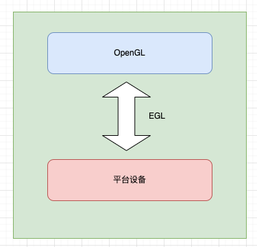

# EGL是什么？
EGL提供如下机制 :
- 与设备的原生窗又系统通信 
- 查询绘图表面的可用类型和配置 
- 创建绘图表面 
- 在OpenGLES 3.0和其他图形渲染API (如桌面OpenGL 和OpenVG- —硬件加速矢 量图形的跨平台API，或者窗又系统的原生绘图命令)之间同步渲染。 
- 管理纹理贴图等渲染资源

EGL 是渲染 API（如 OpenGL ES）和原生窗口系统之间的接口.通常来说，OpenGL 是一个操作 GPU 的 API，它通过驱动向 GPU 发送相关指令，控制图形渲染管线状态机的运行状态，但是当涉及到与本地窗口系统进行交互时，就需要这么一个中间层，且它最好是与平台无关的,
因此 EGL 被设计出来，作为 OpenGL 和原生窗口系统之间的桥梁

与窗又系统通信
----

https://juejin.cn/post/7140454802521063432

